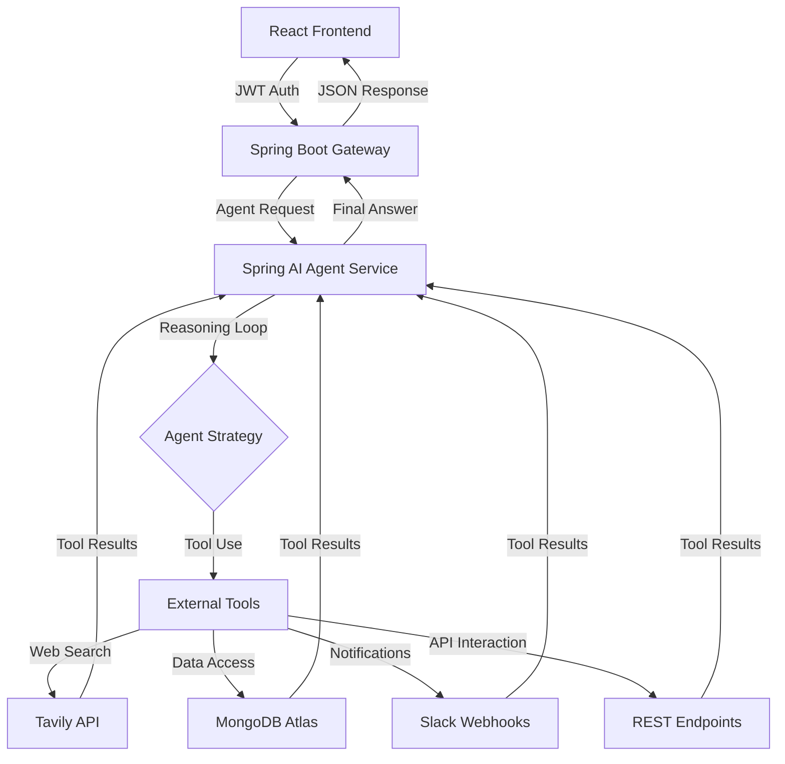

# 🤖 Agent Pilot: Enterprise AI Reasoning Engine

[](https://www.oracle.com/java/)
[](https://spring.io/projects/spring-boot)
[](https://spring.io/projects/spring-ai)
[](https://reactjs.org/)
[](https://www.mongodb.com/)
[](https://www.docker.com/)

> **The next generation of autonomous agentic workflows. Built with Java 21, Spring AI, and high-performance LLM tool-calling.**

---

## 🌟 Overview

**Agent Pilot** is a sophisticated AI-orchestration platform that transforms static LLMs into **Autonomous Agents**. Unlike traditional chatbots, Agent Pilot uses the **ReAct (Reason + Act) pattern** to autonomously plan, use external tools, and execute complex business workflows.

### ⚠️ The Problem
Managing complex technical tasks—like deep web research, database auditing, or multi-step API integrations—manually is time-consuming and error-prone.

### ✅ The Solution
A suite of 6 specialized agents powered by **Spring AI** and **Groq (Llama 3.3)**. These agents don't just "talk"; they "act" by querying databases, searching the web, and notifying teams via Slack—all without human intervention.

---

## 🔗 Live Demo

| Component | Link |
| :--- | :--- |
| **🚀 Live Frontend** | [agentpilot-liard.vercel.app](https://agentpilot-liard.vercel.app/) |
| **🛡️ Backend API** | [agentpilot.onrender.com](https://agentpilot.onrender.com) |
| **📹 Walkthrough** | [Watch the Demo on Loom](https://www.loom.com/share/placeholder) |

---

## 🛠️ Tech Stack

### **Frontend**
*   **Framework:** React 18 (Vite)
*   **Styling:** Vanilla CSS3 (Custom Glassmorphism Design System)
*   **State Management:** React Context API
*   **Deployment:** Vercel

### **Backend**
*   **Runtime:** Java 21 (LTS)
*   **Framework:** Spring Boot 3.2.4
*   **AI Engine:** Spring AI (Groq / OpenAI API shape)
*   **Security:** Spring Security (Stateless JWT + Google OAuth 2.0)
*   **Build Tool:** Maven

### **Infrastructure & AI Tools**
*   **Database:** MongoDB Atlas (Cloud)
*   **LLM:** Groq Llama-3.3-70b (Ultra-fast inference)
*   **Search Engine:** Tavily AI (Agentic Web Search)
*   **Integrations:** Slack Webhooks, REST API Tools
*   **Containerization:** Docker (Multi-stage builds)

---

## 🧠 Core Agent Features

Agent Pilot features **6 production-ready agents**, each with specialized tool access:

*   **🔍 Web Research Agent:** Performs multi-step research using Tavily AI.
*   **🗄️ MongoDB Data Agent:** Discovers schemas and executes secure database queries autonomously.
*   **🔬 Code Review Agent:** Analyzes snippets for bugs, security leaks, and performance bottlenecks.
*   **⚙️ Workflow Automation Agent:** Plans and executes complex tasks across Slack and HTTP APIs.
*   **✍️ Prompt Engineering Agent:** Refines raw ideas into high-performance system instructions.
*   **🔌 API Integration Agent:** Generates and live-tests integration code for third-party services.

---

## 🏗️ Architecture & Workflow

Agent Pilot follows a modern, decoupled architecture designed for high availability and low latency.



---

## 🚀 Installation & Setup

### **Prerequisites**
*   Java 21+
*   Node.js 18+
*   Docker (Optional)
*   MongoDB Atlas Account

### **1. Clone the Repository**
```bash
git clone https://github.com/Ravikiranreddybada/agentpilot.git
cd agentpilot
```

### **2. Backend Setup**
Create a `.env` file in the root:
```env
MONGODB_URI=your_mongo_uri
JWT_SECRET=your_secret
GROQ_API_KEY=your_groq_key
TAVILY_API_KEY=your_tavily_key
GOOGLE_CLIENT_ID=your_google_id
GOOGLE_CLIENT_SECRET=your_google_secret
```

Run with Maven:
```bash
./mvnw spring-boot:run
```

### **3. Frontend Setup**
```bash
cd frontend
npm install
npm run dev
```

---

## 📁 Project Structure

```text
agentpilot/
├── src/main/java/com/toolforge/
│   ├── config/             # Security, AI, & App Configuration
│   ├── controller/         # REST API Endpoints
│   ├── model/              # MongoDB Entities & DTOs
│   ├── repository/         # Spring Data MongoDB Repositories
│   ├── security/           # JWT & OAuth2 Logic
│   ├── service/            # Agentic Reasoning & Business Logic
│   └── tools/              # Specialized AI Tool Implementations
├── src/main/resources/     # Properties & Static Assets
├── frontend/               # React (Vite) Application
├── Dockerfile              # Multi-stage production build
└── pom.xml                 # Maven dependencies
```

---

## 🔮 Future Improvements
- [ ] **Streaming Support:** Implement SSE (Server-Sent Events) for real-time token streaming.
- [ ] **Vector Search:** Integrate Pinecone for RAG (Retrieval-Augmented Generation).
- [ ] **Multi-Agent Orchestration:** Allow agents to talk to each other to solve larger problems.

---

## 🤝 Contributing
Contributions are welcome! Please feel free to submit a Pull Request.

---

## 📄 License
This project is licensed under the MIT License - see the [LICENSE](LICENSE) file for details.

---

## 👨‍💻 Author
**Bada Ravi Kiran Reddy**
*   LinkedIn: [linkedin.com/in/ravikiranreddybada](https://linkedin.com/in/ravikiranreddybada)
*   GitHub: [@Ravikiranreddybada](https://github.com/Ravikiranreddybada)

---
<p align="center">Built with ❤️ using the Spring AI Ecosystem</p>
