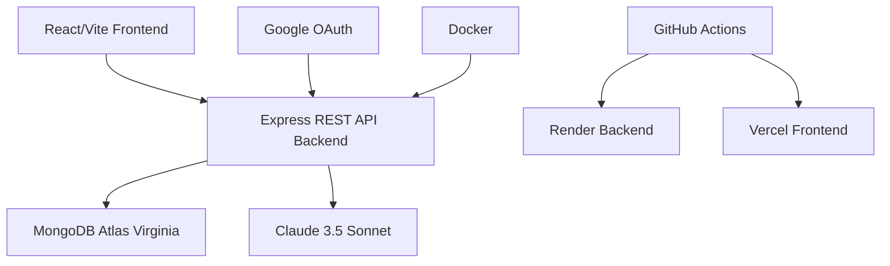

# 🤖 **AgentPilot** — Production LLM Agentic AI Platform   

[](https://agentpilot.onrender.com/health) [](https://agentpilot-liard.vercel.app/) [](https://cloud.mongodb.com)

**Production MERN stack** with **4 Claude-powered AI agents** for enterprise workflows. Auth: Google OAuth + Local. Docker ready.

## 🎥 Live Demo
| Home | Dashboard | AI Agents |
|---|---|---|
|  |  |  |

## 🚀 4 Production AI Agents

| Agent | Use Case | Input → Output |
|---|---|---|
| **🔍 Web Research** | Complex research | \"Market analysis for EVs\" → Structured report |
| **🗄️ SQL Generator** | Natural language → SQL | Schema + \"Top customers last month\" → Optimized query |
| **🔬 Code Review** | Code analysis | Paste JS/Python → Bugs + refactored code + score |
| **⚙️ Workflow Planner** | Automation planning | \"Automate invoice processing\" → LangChain code |

## 🛠 Tech Stack



## 🔥 Live URLs
- **Backend API**: https://agentpilot.onrender.com/health `{"status":"ok"}`
- **Frontend**: https://agentpilot-liard.vercel.app/
- **Repo**: https://github.com/Ravikiranreddybada/agentpilot

## ⚡ 2-Minute Deploy

**Backend (Render)**:
```bash
# Auto-deploy from GitHub → Render
# Add env vars: MONGODB_URI, SESSION_SECRET, ANTHROPIC_API_KEY
# + GOOGLE_CLIENT_ID/SECRET for auth
```

**Frontend (Vercel)**:
```bash
vercel --prod  # Auto-detects Vite
```

## 🔑 Production Environment
```
MONGODB_URI=mongodb+srv://...@agent.79exgov.mongodb.net/agentpilot
GOOGLE_CLIENT_ID=517648747100-9eatflldhu4mlvr9po058kb26pkubug8.apps.googleusercontent.com  
ANTHROPIC_API_KEY=your_key
FRONTEND_URL=https://agentpilot-liard.vercel.app
```

## 👨‍💻 Team
**Bada Ravi Kiran Reddy** - Fullstack Architect & Deploy Maestro

[](https://anthropic.com/claude)

---

⭐ **Star us on GitHub!** Production-ready Agentic AI platform.
