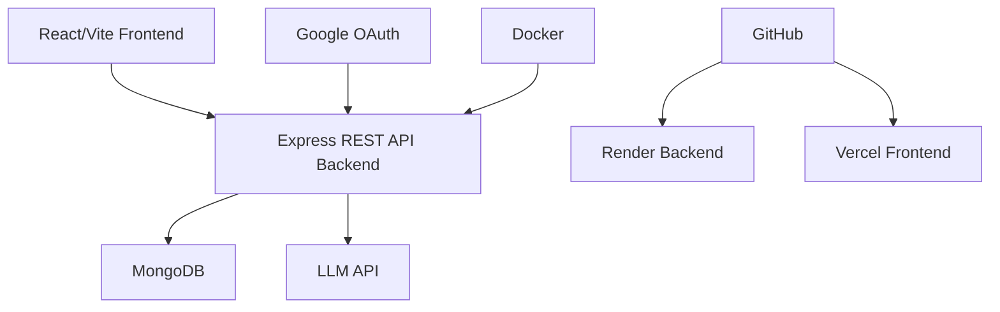

# 🤖 **AgentPilot** — LLM Agentic AI Platform 

[] [] []

**Cloud-ready MERN stack** with **4 LLM-powered AI agents** for workflows. Auth: Google OAuth + Local. Docker support.

## 🚀 4 AI Agents

| Agent | Use Case | Input → Output |
|---|---|---|
| **🔍 Web Research** | Complex research | \"Market analysis for EVs\" → Structured report |
| **🗄️ SQL Generator** | Natural language → SQL | Schema + \"Top customers last month\" → Optimized query |
| **🔬 Code Review** | Code analysis | Paste JS/Python → Bugs + refactored code + score |
| **⚙️ Workflow Planner** | Automation planning | \"Automate invoice processing\" → LangChain code |

## 🛠 Tech Stack



## 🚀 Run

Connect your GitHub repo.

### Backend (Render)
1. Fork/clone this repo.
2. Create Render service → Connect GitHub repo → Select `backend/` as root.
3. Build: `npm install` | Start: `npm start`
4. Add generic env vars (see template below).
5. Service ready!

### Frontend (Vercel)
1. `cd frontend`
2. `vercel --prod`
3. Set `VITE_API_URL=https://your-render-app.onrender.com`
4. Auto Vite build → Ready!

### Docker Self-Host (Alternative)
```
docker-compose up -d
# Auto builds frontend/backend, connects to your MongoDB
```

**Repo**: https://github.com/Ravikiranreddybada/agentpilot

## 🏠 Local Development Quick Start

1. Clone repo: `git clone <repo> && cd agentpilot`
2. Backend:
   ```
   cd backend
   npm install
   cp .env.example .env  # Add your vars
   npm run dev  # or npm start
   ```
3. Frontend (new terminal):
   ```
   cd frontend
   npm install
   npm run dev  # http://localhost:5173
   ```
4. Access: http://localhost:5173 (frontend) | http://localhost:5000 (backend)

**Docker Local**:
```
docker-compose up
# Visit http://localhost:5173
```

## 🔑 Environment Variables Template
Copy to `.env` files (backend/frontend):

**backend/.env**:
```
NODE_ENV=development
MONGODB_URI=mongodb://localhost:27017/agentpilot  # or your Atlas URI
SESSION_SECRET=your_long_random_secret_here
GOOGLE_CLIENT_ID=your_google_client_id
GOOGLE_CLIENT_SECRET=your_google_secret
GOOGLE_CALLBACK_URL=http://localhost:5000/auth/google/callback
ANTHROPIC_API_KEY=your_anthropic_key  # Optional for AI features
FRONTEND_URL=http://localhost:5173
```

**frontend/.env** (via Vite):
```
VITE_API_URL=http://localhost:5000
```

## 👨‍💻 Creator
**Bada Ravi Kiran Reddy** — Fullstack & DevOps

---

⭐ Cloud-ready Agentic AI Platform. Quick setup on Render/Vercel or run locally/Docker!

